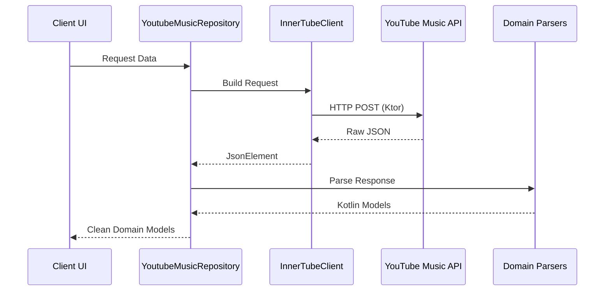

# YouTubeMusic KtEngine 🎵


A lightweight, fully asynchronous Kotlin library for interacting with the **YouTube Music InnerTube API**.

Built from the ground up for Android and JVM applications, **YouTubeMusic KtEngine** provides clean architecture, efficient networking, resilient JSON parsing, and strongly typed Kotlin models without relying on the official YouTube Music API.

> **Note:** This library uses YouTube Music's unofficial InnerTube API and does not require an API key.

---

## ✨ Features

- 🚀 No API key required
- ⚡ Fully asynchronous with Kotlin Coroutines
- 🌐 Fast networking powered by Ktor CIO
- 📦 Strongly typed Kotlin models
- 🧩 Resilient JSON parsing using `kotlinx.serialization`
- 🏗️ Clean architecture with separated networking, parsing, and repository layers
- 🎵 Designed specifically for Android music streaming applications

---

## 🛠 Tech Stack

| Component | Technology |
|-----------|------------|
| Language | Kotlin (JVM Toolchain 19) |
| Networking | Ktor Client (CIO) |
| Concurrency | Kotlinx Coroutines |
| Serialization | Kotlinx Serialization JSON |

---
## 📦 Installation


Add the JitPack repository:

```kotlin
repositories {
    mavenCentral()
    maven("https://jitpack.io")
}
```

Add the dependency:

```kotlin
dependencies {
    implementation("com.github.DivyansPathak:ytmusic-engine-kotlin:<latest-version>")
}
```

Replace `<latest-version>` with the version shown in the badge above (for example, `v1.0.5`).
---

## 🚀 Quick Start

```kotlin
import kotlinx.coroutines.runBlocking
import network.InnerTubeClient
import repository.YoutubeMusicRepository

fun main() = runBlocking {

    val client = InnerTubeClient()
    val repository = YoutubeMusicRepository(client)

    try {

        // Search songs
        val searchResults = repository.searchSongs("Without Me")

        searchResults.take(3).forEach { track ->
            println(
                "Found: ${track.title} by ${
                    track.artists.joinToString { it.name }
                }"
            )
        }

        // Fetch Home Feed
        val homeFeed = repository.home()
        println("Home feed fetched successfully.")

        // Generate a Radio Queue
        if (searchResults.isNotEmpty()) {
            val radioQueue = repository.radio(searchResults.first().videoId)
            println("Loaded ${radioQueue.size} tracks.")
        }

    } finally {
        client.close()
    }
}
```

---

## ✅ Supported Endpoints

| Endpoint | Status |
|----------|:------:|
| Search | ✅ |
| Home Feed | ✅ |
| Radio | ✅ |
| Album | ✅ |
| Playlist | ✅ |
| Artist | ✅ |


> More endpoints will be added over time.

---

## 🧠 Architecture

The library follows a layered architecture where networking, parsing, and domain models remain isolated from the UI layer.



---

## 📂 Project Structure

```text
src/
├── model/
├── network/
├── parser/
├── repository/
└── utils/
```

---

## 🚧 Roadmap

- [x] Search
- [x] Home Feed
- [x] Radio
- [x] Albums
- [x] Playlists
- [x] Artists
- [ ] Lyrics
- [ ] Authentication support
- [ ] Playlist editing
- [ ] Additional InnerTube endpoints

---

## 🤝 Contributing

Contributions, issues, and feature requests are welcome.

If you're building an Android or JVM music application and would like additional InnerTube endpoints supported, feel free to open an issue or submit a pull request.

---

## ⚠️ Disclaimer

This project is an **unofficial implementation** of the YouTube Music InnerTube API.

It is **not affiliated with, endorsed by, or maintained by Google or YouTube**. The API may change at any time, which could require updates to this library.

---

## 📝 License

This project is licensed under the **MIT License**.

See the [LICENSE](LICENSE) file for details.
